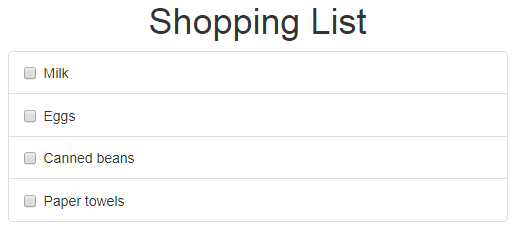

# Frontend - Display View Model Data in the Browser

In the previous lesson, you modified your application so that it can answer queries. However, at this moment, your application does not provide a frontent that would present this data to an end-user. In this lesson, you will learn how to create a React frontend to display your reSolve application's data.

This tutorial sticks to React + redux as the default choice for building a frontend for a reSolve application. Both React and redux work well in congunction with reSolve's infrastructure. To facilitate interoperability of React + redux on the client and reSolve on the server, the **resolve-redux** library is provided. This library contains HOCs allowing you to easily connect your React components to the backend.

Note that, if required, you can use the standard HTTP API to communicate with a reSolve backend and implement the frontend using any client side technology.

### Implement a React Frontend

Create a **ShoppingList.js** file end the client application's containers folder. In this file, implement a component that displays a list of values obtained ftom the **data** prop:

**client/containers/ShoppingList.js**

<!-- prettier-ignore-start -->
[embedmd]:# (../../examples/shopping-list-tutorial/lesson-4/client/containers/ShoppingList.js /import \{ ListGroup/ /^\}/)
```js
import { ListGroup, ListGroupItem, Checkbox } from 'react-bootstrap'

export class ShoppingList extends React.PureComponent {
  render() {
    const list = this.props.data
    return (
      <ListGroup style={{ maxWidth: '500px', margin: 'auto' }}>
        {list.map(todo => (
          <ListGroupItem key={todo.id}>
            <Checkbox inline>{todo.text}</Checkbox>
          </ListGroupItem>
        ))}
      </ListGroup>
    )
  }
}
```
<!-- prettier-ignore-end -->

The example code uses components from the **react-bootstrap** library to keep the markup compact.

Now you can use the **resolve-redux** library's **connectViewModel** function to bind your component to **ShoppingList** view model implemented earlier:

<!-- prettier-ignore-start -->
[embedmd]:# (../../examples/shopping-list-tutorial/lesson-4/client/containers/ShoppingList.js /export const mapStateToOptions/ /export default connectViewModel/)
```js
export const mapStateToOptions = (state, ownProps) => {
  return {
    viewModelName: 'ShoppingList',
    aggregateIds: ['root-id']
  }
}

export default connectViewModel
```
<!-- prettier-ignore-end -->

Now you can place the shopping list within the application's root component:

**client/containers/App.js**

``` js
const App = () => (
  <div>
    ...
    <ShoppingList></ShoppingList>
  </div>
)
```

Run your application to see the result:

