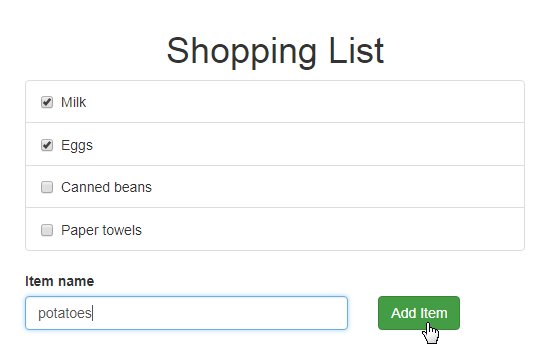

# Lesson 5 - Frontend - Enable Data Editing

### Modify Backend Functionality

Your application already implements logic required to add new list items. Apply the following modifications to the server code to also support item checking:

1. Add a new event type that signals about the item checkbox being toggled.

**[common/eventTypes.js:](../../examples/shopping-list-tutorial/lesson-5/common/eventTypes.js)**

<!-- prettier-ignore-start -->

[embedmd]:# (../../examples/shopping-list-tutorial/lesson-5/common/eventTypes.js /export const SHOPPING_ITEM_TOGGLED/ /\n$/)
```js
export const SHOPPING_ITEM_TOGGLED = "SHOPPING_ITEM_TOGGLED";
```

<!-- prettier-ignore-end -->

2. Add a command handler that produces the added event in response to the **toggleShoppingItem** command.

**[common/aggregates/shopping_list.commands.js](../../examples/shopping-list-tutorial/lesson-5/common/aggregates/shopping_list.commands.js):**

<!-- prettier-ignore-start -->

[embedmd]:# (../../examples/shopping-list-tutorial/lesson-5/common/aggregates/shopping_list.commands.js /^[[:blank:]]+toggleShoppingItem/   /^[[:blank:]]{2}\}/)
```js
  toggleShoppingItem: (state, { payload: { id } }) => {
    if (!state || Object.keys(state).length === 0) {
      throw new Error(`shopping list does not exist`)
    }
    if (!id) throw new Error('id is required')
    return {
      type: SHOPPING_ITEM_TOGGLED,
      payload: { id }
    }
  }
```

<!-- prettier-ignore-end -->

The event payload contains the toggled item's identifier.

4. Modify the **ShoppingList** View Model projection to apply **SHOPPING_ITEM_TOGGLED** events to the data sample.

**[common/view-models/shopping_list.projection.js:](../../examples/shopping-list-tutorial/lesson-5/common/view-models/shopping_list.projection.js)**

<!-- prettier-ignore-start -->

[embedmd]:# (../../examples/shopping-list-tutorial/lesson-5/common/view-models/shopping_list.projection.js /^[[:space:]]+\[SHOPPING_ITEM_TOGGLED\]/   /^[[:blank:]]+\}\)/)
```js
  [SHOPPING_ITEM_TOGGLED]: (state, { payload: { id } }) => ({
    ...state,
    list: state.list.map(item =>
      item.id === id
        ? {
            ...item,
            checked: !item.checked
          }
        : item
    )
  })
```

<!-- prettier-ignore-end -->

### Implement Data Editing UI

In the previous lesson, you connected your ShoppingList to a reSolve View Model. Because of this, the connected component's props already include an array of Redux action creators used to dispatch Redux actions on the client and send the corresponding commands to the reSolve application on the server. To make use of these action creators to implement editing in your application, update the ShoppingList component's View Model binding code as shown below:

**[common/view-models/shopping_list.projection.js:](../../examples/shopping-list-tutorial/lesson-5/common/view-models/shopping_list.projection.js)**

<!-- prettier-ignore-start -->

[embedmd]:# (../../examples/shopping-list-tutorial/lesson-5/client/containers/ShoppingList.js /export const mapDispatchToProps/   /\n$/)
```js
export const mapDispatchToProps = (dispatch, { aggregateActions }) =>
  bindActionCreators(
    {
      ...aggregateActions
    },
    dispatch
  );

export default connectViewModel(mapStateToOptions)(
  connect(
    null,
    mapDispatchToProps
  )(ShoppingList)
);
```

<!-- prettier-ignore-end -->

In this code, the component is first connected to a **Redux** state using the **connect** HOC from the **react-redux** library. Then, the component is connected to a reSolve View Model as it was in the previous lesson. The **connect** function is called with the specified **mapDispatchToProps** function. This function takes reSolve aggregate actions from the components payload and wraps them into a **dispatch** function call using the the **bindActionCreators** function.

Now the ShoppingList component's props include the **toggleShoppingItem** function.

**[common/view-models/shopping_list.projection.js:](../../examples/shopping-list-tutorial/lesson-5/common/view-models/shopping_list.projection.js)**

```js
render() {
  const toggleShoppingItem = this.props.toggleShoppingItem;
  ...
```

You can use this function to handle item checking on the client and send the **toggleShoppingItem** command to the server along with the required data in the payload.

In the code below, the **toggleShoppingItem** function is used to handle checkbox click events.

**[client/containers/ShoppingList.js:](../../examples/shopping-list-tutorial/lesson-5/client/containers/ShoppingList.js)**

<!-- prettier-ignore-start -->

[embedmd]:# (../../examples/shopping-list-tutorial/lesson-5/client/containers/ShoppingList.js /^[[:space:]]+\<Checkbox/   /\<\/Checkbox\>/)
```js
              <Checkbox
                inline
                checked={todo.checked}
                onClick={toggleShoppingItem.bind(null, "shopping-list-1", {
                  id: todo.id
                })}
              >
                {todo.text}
              </Checkbox>
```

<!-- prettier-ignore-end -->

In the same way, you can use the **createShoppingItem** function to add new shopping list items. The UI markup is shown below:

**[common/view-models/shopping_list.projection.js:](../../examples/shopping-list-tutorial/lesson-5/common/view-models/shopping_list.projection.js)**

<!-- prettier-ignore-start -->

[embedmd]:# (../../examples/shopping-list-tutorial/lesson-5/client/containers/ShoppingList.js /^[[:space:]]+\<ControlLabel\>Item name/   /\<\/Row\>/)
```js
        <ControlLabel>Item name</ControlLabel>
        <Row>
          <Col md={8}>
            <FormControl
              className="example-form-control"
              type="text"
              value={this.state.itemText}
              onChange={this.updateItemText}
              onKeyPress={this.onItemTextPressEnter}
            />
          </Col>
          <Col md={4}>
            <Button
              className="example-button"
              bsStyle="success"
              onClick={this.createShoppingItem}
            >
              Add Item
            </Button>
          </Col>
        </Row>
```

<!-- prettier-ignore-end -->

This markup uses the following methods to handle UI interaction.

**[common/view-models/shopping_list.projection.js:](../../examples/shopping-list-tutorial/lesson-5/common/view-models/shopping_list.projection.js)**

```js
createShoppingItem = () => {
  this.props.createShoppingItem('shopping-list-1', {
    text: this.state.itemText,
    id: Date.now().toString()
  })

  this.setState({
    itemText: ''
  })
}

updateItemText = event => {
  this.setState({
    itemText: event.target.value
  })
}

onItemTextPressEnter = event => {
  if (event.charCode === 13) {
    event.preventDefault()
    this.createShoppingItem()
  }
}
```

After these steps, your application's client UI should look as shown below.


